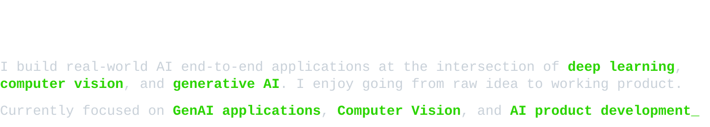

&nbsp;&nbsp;&nbsp;&nbsp;<picture><source media="(prefers-color-scheme: dark)" srcset="./assets/name-banner.svg"><source media="(prefers-color-scheme: light)" srcset="./assets/about-me-light.svg"></picture>

  
  
  
  
  

<picture><source media="(prefers-color-scheme: dark)" srcset="./assets/about-me-dark.svg"><source media="(prefers-color-scheme: light)" srcset="./assets/about-me-light.svg"></picture>

## Featured Projects

| Project | Description | Stack |
|---|---|---|
| 🤟 **[Gesture Bridge](https://github.com/arcaneleague18/GestureBridge.git)** | Real-time sign language translator with reverse skeleton animation replay | Python · Keras · MediaPipe · Sarvam AI |
| ⚖️ **[T&C Summarizer](https://github.com/arcaneleague18/terms-analyser-streamlit.git)** | Streamlit Application that summarizes Terms & Conditions and flags offensive clauses | LangChain · FastAPI · HuggingFace · Streamlit |
| 🕶️ **[3Dify](https://github.com/arcaneleague18/3Dify.git)** | A web-based tool that takes a standard 2D image and automatically converts it into high-quality 3D stereoscopic formats. | OpenCV · Torch · Transformers · Gradio |
| 👑 **[Community Hero](https://github.com/arcaneleague18/community-hero.git)** | Hyperlocal problem solver and civic issue reporting platform. Built entirely with AI Studio | AI Studio · React · TypeScript · Firebase |

## Tech Stack

 
 
 
 

## GitHub Stats

## Activity Graph

  

## `[HISTORY]` process trail

  <picture>
    <source media="(prefers-color-scheme: dark)"  srcset="https://raw.githubusercontent.com/arcaneleague18/arcaneleague18/output/snake-dark.svg"/>
    <source media="(prefers-color-scheme: light)" srcset="https://raw.githubusercontent.com/arcaneleague18/arcaneleague18/output/snake.svg"/>
    
  </picture>

**Open to internships and collaborations in AI/ML, GenAI, and Agentic AI**

[📬 varunkarli18@gmail.com](mailto:varunkarli18@gmail.com) · [💼 Connect on LinkedIn](https://www.linkedin.com/in/varun-karli)

